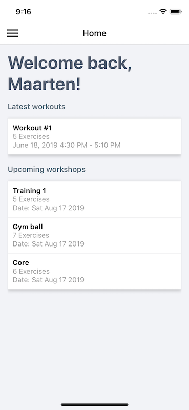
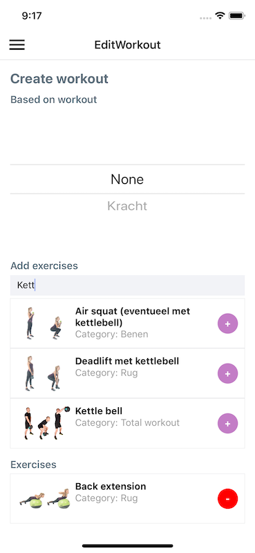
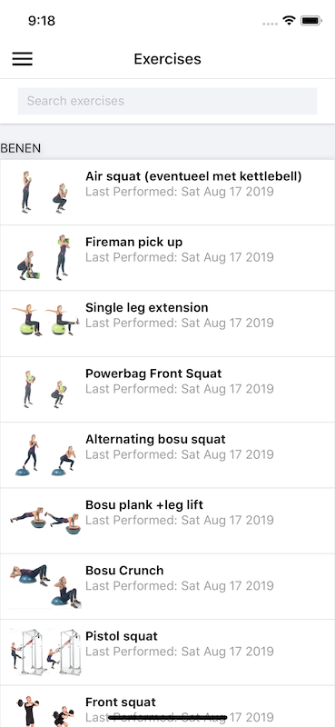
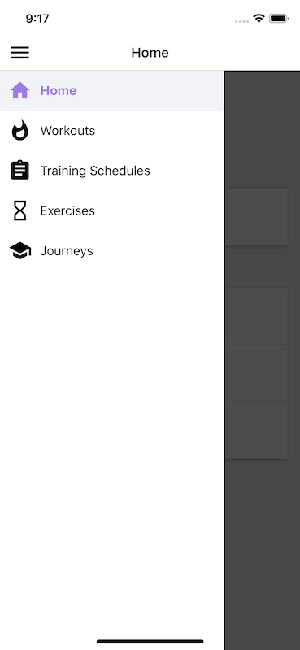

# TrainingPlan
Application that uses the [TrainingPlan](https://github.com/MaartenGDev/training-plan-api) api project

## Setup
1. Setup the [API](https://github.com/MaartenGDev/training-plan-api)
2. `npm install`
3. `react-native run-ios` or `react-native run-android`

## Demo

